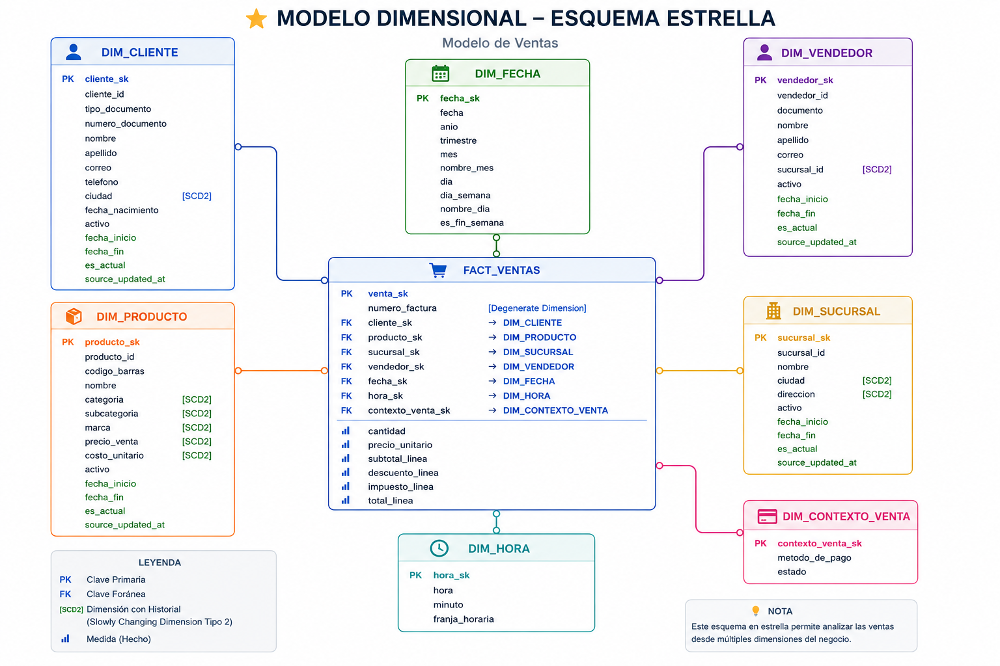

# Supermarket Data Platform

End-to-end Data Engineering project that simulates a supermarket data platform.

The project implements a Lakehouse-style architecture using PostgreSQL, Apache Spark, Delta Lake and Docker, following a Medallion Architecture with Bronze, Silver and Gold layers.

The main goal is to build a reproducible data platform capable of extracting operational supermarket data, processing it incrementally, preserving historical changes, applying data quality rules and transforming the data into a dimensional model optimized for analytics.

---

## Project Status

**Current stage: Gold Layer - Dimensional Modeling**

### Completed

- PostgreSQL operational source database
- Synthetic supermarket dataset generation
- Dockerized development environment
- Apache Spark Master and Worker
- PostgreSQL JDBC integration with Spark
- Delta Lake integration
- Bronze Layer
- Incremental source-to-Bronze ingestion
- Bronze Delta tables with transaction history
- Silver Layer
- Incremental Bronze-to-Silver processing
- Data cleaning and normalization
- Basic data quality validations
- Exact technical duplicate removal
- Historical source versions preserved in Silver
- Gold dimensional model designed
- SCD Type 1 / Type 2 strategy defined
- Fact table grain defined
- Data quality strategy for invoice reconciliation defined

### In Progress

- Gold Layer implementation
- Surrogate key generation
- Slowly Changing Dimensions
- Gold fact table
- Gold data quality and quarantine

### Planned

- Automated data quality checks
- Quarantine datasets
- Apache Airflow orchestration
- Pipeline retries and dependency management
- End-to-end pipeline execution
- Analytics / dashboard layer
- Monitoring and logging improvements
- Final technical documentation

---

## Architecture

The platform follows a Medallion Architecture:

```text
Operational PostgreSQL
        |
        v
   Apache Spark
        |
        v
+----------------+
|     BRONZE     |
|   Delta Lake   |
| Raw / History  |
+----------------+
        |
        v
   Apache Spark
        |
        v
+----------------+
|     SILVER     |
|   Delta Lake   |
| Clean / Valid  |
+----------------+
        |
        v
   Apache Spark
        |
        v
+----------------+
|      GOLD      |
| Dimensional    |
|     Model      |
+----------------+
        |
        v
Analytics / BI
```

Apache Airflow will later orchestrate the complete pipeline.

---

## Technology Stack

| Technology | Purpose |
|---|---|
| PostgreSQL 16 | Operational source database |
| Apache Spark 3.5.1 | Distributed data processing |
| PySpark | Data extraction and transformation |
| Delta Lake | ACID tables, versioning and Lakehouse storage |
| Docker | Reproducible execution environment |
| Docker Compose | Multi-container infrastructure |
| Python | Data generation and processing |
| Git / GitHub | Version control and project documentation |
| Apache Airflow | Pipeline orchestration - planned |

---

# Data Flow

The current pipeline follows:

```text
PostgreSQL
    |
    | Incremental extraction
    v
BRONZE
    |
    | Cleaning
    | Normalization
    | Validation
    | Technical deduplication
    v
SILVER
    |
    | Dimensional transformations
    | Surrogate keys
    | SCD Type 1 / Type 2
    | Business quality rules
    v
GOLD
    |
    v
Analytics
```

---

# Bronze Layer

Bronze stores source data using Delta Lake while preserving source-level history.

Different incremental strategies are used depending on the characteristics of each source table.

Examples include:

- Incremental extraction using increasing IDs
- Incremental extraction using `updated_at`
- Full reload for small tables where appropriate

Bronze intentionally preserves multiple source versions when records are updated.

This allows downstream layers to determine how historical changes should be interpreted.

---

# Silver Layer

Silver transforms Bronze data into validated and standardized datasets.

Current transformations include:

- Required-field validation
- Null validation
- Text normalization
- Email format validation
- Numeric range validation
- Technical duplicate removal
- Incremental processing
- Preservation of meaningful source versions

Silver does not apply dimensional SCD logic.

Historical versions are preserved so the Gold layer can determine whether changes should be treated as SCD Type 1 or SCD Type 2.

---

# Gold Layer

Gold transforms Silver datasets into a dimensional model optimized for analytical workloads.

The main business process modeled is:

> **Supermarket product sales**

The dimensional model follows a star-schema-oriented design.

---

## Gold Star Schema



The central fact table is:

```text
fact_ventas
```

Dimensions:

```text
dim_cliente
dim_producto
dim_sucursal
dim_vendedor
dim_fecha
dim_hora
dim_contexto_venta
```

---

# Fact Table Grain

The grain of `fact_ventas` is:

> **One row represents one product line within one invoice.**

For example:

```text
Invoice FAC-001

Product A x2
Product B x1
Product C x3
```

produces three rows in `fact_ventas`.

Maintaining atomic transaction grain allows sales to be aggregated across products, customers, stores, employees and time.

---

# fact_ventas

The planned structure is:

```text
venta_sk

numero_factura

cliente_sk
producto_sk
sucursal_sk
vendedor_sk
fecha_sk
hora_sk
contexto_venta_sk

cantidad
precio_unitario

subtotal_linea
descuento_linea
impuesto_linea
total_linea
```

`numero_factura` is modeled as a **degenerate dimension** and is stored directly in the fact table.

---

# Line-Level Measures

Invoice-level amounts are not duplicated across product lines.

Instead, measures are calculated at the grain of the fact table:

```text
subtotal_linea
descuento_linea
impuesto_linea
total_linea
```

For example:

```text
subtotal_linea =
cantidad * precio_unitario

descuento_linea =
cantidad * descuento_unitario

impuesto_linea =
cantidad * impuesto_unitario
```

Invoice totals can then be reconstructed using aggregation:

```text
SUM(subtotal_linea)
SUM(descuento_linea)
SUM(impuesto_linea)
SUM(total_linea)
```

This allows the same measures to be analyzed by:

- Invoice
- Product
- Customer
- Store
- Employee
- Date
- Time
- Payment context

---

# Invoice Reconciliation and Data Quality

Before publishing sales into Gold, line-level calculated amounts will be compared with the original invoice totals stored in Silver.

Conceptually:

```text
Silver facturas
       |
       | invoice totals
       |
       v
    Validation
       ^
       |
SUM(Silver detalle_factura)
```

Expected validation:

```text
SUM(subtotal_linea)  == facturas.subtotal

SUM(descuento_linea) == facturas.descuento_total

SUM(impuesto_linea)  == facturas.impuesto_total

SUM(total_linea)     == facturas.total
```

Valid invoices:

```text
Validation
    |
    v
Gold fact_ventas
```

Invalid invoices:

```text
Validation
    |
    v
Quarantine
```

Quarantine preserves rejected records together with the reason for rejection so data quality problems can be investigated instead of silently deleting data.

---

# Slowly Changing Dimensions

The Gold layer will implement a combination of SCD Type 1 and SCD Type 2.

## dim_cliente

SCD Type 2:

```text
ciudad
```

Other mutable descriptive attributes are handled as SCD Type 1.

---

## dim_producto

SCD Type 2:

```text
categoria
subcategoria
marca
precio_venta
costo_unitario
```

Other descriptive attributes use SCD Type 1.

---

## dim_sucursal

SCD Type 2:

```text
ciudad
direccion
```

Other descriptive attributes use SCD Type 1.

---

## dim_vendedor

SCD Type 2:

```text
sucursal_id
```

Other descriptive attributes use SCD Type 1.

---

# SCD Technical Columns

Dimensions implementing SCD Type 2 use:

```text
fecha_inicio
fecha_fin
es_actual
source_updated_at
```

Example:

```text
cliente_sk | cliente_id | ciudad   | fecha_inicio | fecha_fin | es_actual
-----------|------------|----------|--------------|-----------|----------
10         | 2          | Medellín | ...          | ...       | false
55         | 2          | Cali     | ...          | NULL      | true
```

A new surrogate key is generated when an SCD Type 2 attribute changes.

---

# Surrogate Keys

Gold dimensions use warehouse-generated surrogate keys.

Examples:

```text
cliente_sk
producto_sk
sucursal_sk
vendedor_sk
```

Operational IDs are preserved as business/source keys:

```text
cliente_id
producto_id
sucursal_id
vendedor_id
```

This separation allows multiple historical versions of the same source entity to exist.

For example:

```text
cliente_sk | cliente_id | ciudad
-----------|------------|----------
10         | 2          | Medellín
55         | 2          | Cali
```

Both rows represent the same operational customer but different historical dimensional versions.

---

# Date and Time Dimensions

Date and time are modeled independently.

## dim_fecha

Includes attributes such as:

```text
fecha_sk
fecha
anio
trimestre
mes
nombre_mes
dia
dia_semana
nombre_dia
es_fin_semana
```

## dim_hora

Includes:

```text
hora_sk
hora
minuto
franja_horaria
```

Separating date and time keeps the dimensions compact and allows independent temporal analysis.

---

# Sales Context Dimension

`dim_contexto_venta` is implemented using the **junk dimension** pattern.

It groups small categorical attributes related to the transaction:

```text
contexto_venta_sk
metodo_de_pago
estado
```

Example:

```text
contexto_venta_sk | metodo_de_pago   | estado
------------------|------------------|---------
1                 | EFECTIVO         | PAGADA
2                 | TARJETA_DEBITO   | PAGADA
3                 | TARJETA_CREDITO  | PAGADA
4                 | EFECTIVO         | CANCELADA
```

`fact_ventas` stores only `contexto_venta_sk`.

---

# Incremental Processing

The platform is designed to avoid unnecessarily reprocessing all available data.

Current behavior:

```text
Source
  |
  | incremental
  v
Bronze
  |
  | incremental
  v
Silver
  |
  | incremental / SCD processing
  v
Gold
```

If a pipeline is executed again without new source data, previously processed records are not inserted again.

---

# Project Principles

The project follows several Data Engineering principles:

- Reproducible infrastructure
- Incremental processing
- Idempotent pipeline behavior
- Separation of raw, clean and analytical layers
- Historical traceability
- Dimensional modeling
- Data quality validation
- Explicit business rules
- Version-controlled documentation
- Reusable transformation logic
- Separation between orchestration and transformation

---

# Repository Structure

```text
supermarket-data-platform/
|
├── docker/
│   └── spark/
│       └── Dockerfile
|
├── docs/
│   └── data-model/
│       └── esquema_estrella_ventas_vector.svg
|
├── src/
│   └── spark/
│       ├── bronze/
│       ├── silver/
│       │   ├── common.py
│       │   ├── transform_all_tables.py
│       │   └── transformations/
│       └── gold/
|
├── sql/
├── data/
├── docker-compose.yml
├── requirements.txt
└── README.md
```

The structure will continue evolving as the Gold and orchestration layers are implemented.

---

# Next Milestone

The next development milestone is the implementation of the Gold layer.

Implementation order:

1. `dim_cliente`
2. `dim_producto`
3. `dim_sucursal`
4. `dim_vendedor`
5. `dim_fecha`
6. `dim_hora`
7. `dim_contexto_venta`
8. Invoice reconciliation and quarantine
9. `fact_ventas`
10. Incremental Gold processing
11. End-to-end validation

After Gold is stable, Apache Airflow will be introduced to orchestrate the complete pipeline.

---

## Author

Data Engineering portfolio project focused on building an end-to-end Lakehouse data platform using PostgreSQL, Apache Spark, PySpark, Delta Lake and Docker.